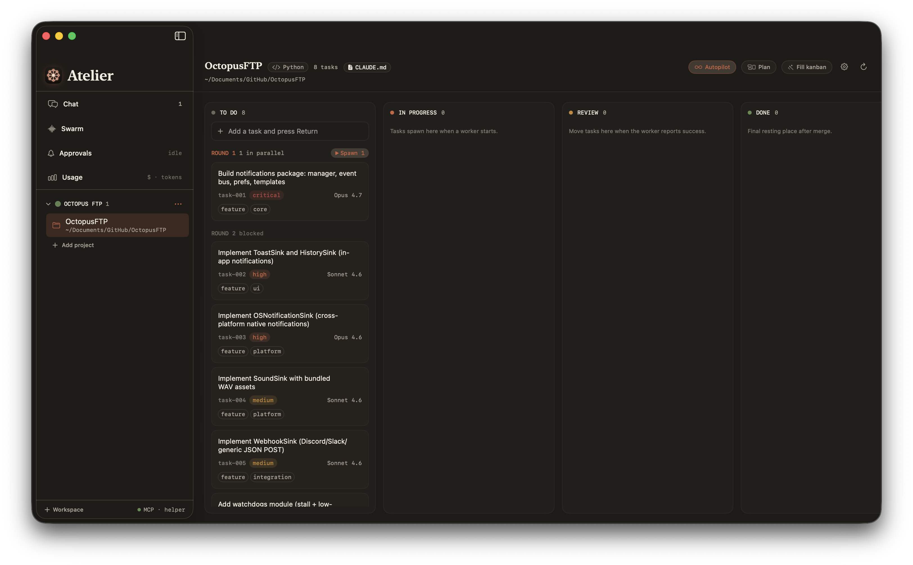

# Atelier

**A native macOS studio for orchestrating parallel Claude Code agents** — each one working in its own git worktree, gated by a human-in-the-loop approval inbox, with live cost and usage tracking.

[](LICENSE)


> [!WARNING]
> **Alpha software.** Atelier is at `v1.0.0-alpha.1` — a lot works well, but expect rough edges: some features are still incomplete or not perfectly polished, and behaviour may change between releases.
>
> **Autopilot burns tokens.** The autonomous *Auto mode* builds, reviews, fixes, and merges whole rounds of work unattended — that's a lot of Claude calls. We recommend a **Max (5×) plan or higher**, or be ready to spend a fair amount of API credit. Start with 1–2 batches and set a spend cap. (See [Autopilot](#autopilot) below.)
>
> **Feedback is very welcome.** This is an early alpha and we're actively listening — [open an issue](https://github.com/arnaultpascual/atelier/issues) with bugs, rough edges, or ideas.

Atelier turns Claude Code from a single terminal session into a workshop: you keep a Kanban backlog of tasks, dispatch agents to work them in parallel, watch each one stream its reasoning and tool calls in real time, approve or deny the actions you care about, then review the resulting git diff before anything touches your main branch.

<!-- Drop a screenshot or screen recording here once you have one:
<p align="center"></p>
-->

## Why

The `claude` CLI is excellent at one task in one place. But real work is several tasks at once, and letting an autonomous agent run unattended on your working tree is nerve-wracking. Atelier addresses both:

- **Parallelism with isolation** — every task runs in a dedicated `git worktree` on its own branch, so agents never step on each other or on your uncommitted work.
- **Control without babysitting** — a `PreToolUse` hook routes each tool call back to an in-app approval inbox. Allow once, deny, or teach a per-project rule so routine calls auto-approve next time.
- **Cost you can see** — per-task, per-message, and cross-project spend, plus live subscription-limit tracking.

## Features

- **Workspaces & projects** — group your repositories; Atelier detects each project's stack (Swift/Apple, Next.js, Node, Python, Rust, Go, Android/Kotlin, docs).
- **Kanban backlog** — tasks live as Markdown files in `<repo>/backlog/tasks/*.md` (the disk is the source of truth; the database is just an index). Five columns: To Do → In Progress → Review → Done → Blocked.
- **AI task decomposition** — paste a brief and let Opus 4.7 break it into dependency-aware task drafts, optionally after inspecting the repository. Review the drafts before they land.
- **Execution waves** — tasks are grouped by dependency depth so you can batch-spawn a whole round of work that's unblocked right now.
- **Parallel agents** — each spawn launches a `claude` subprocess in its worktree and streams the full NDJSON timeline (assistant text, tool calls, results, cost) into a live inspector.
- **Swarm view** — a single dashboard of every live and recently-finished agent.
- **Human-in-the-loop approvals** — gate every tool call, with per-project learned permission rules.
- **Worktree review** — see the git diff a task produced, ask Opus for a code review, **iterate** by resuming the session with follow-up instructions, or mark it done. You merge manually — agents never run `git merge`, `push`, or `rebase`.
- **Autopilot** — hand the whole backlog off: build a round in parallel → Opus reviews each task → only critical/major fixes are auto-applied → merge into a throwaway `atelier/autopilot-*` branch with `--no-ff` → resolve conflicts → repeat for *N* batches. Deny rules still win, your base branch is never touched, nothing is pushed, and a worker stopped by a usage limit pauses with a one-click **Resume**.
- **Project profiles & skills** — matching `SKILL.md` guidance is injected into each worktree's `.claude/skills/` automatically.
- **Chat** — free-form Claude conversations that don't need a project, with optional file/web access.
- **Usage dashboard** — cross-project cost and token analytics drawn from both Atelier's own runs and your wider Claude Code history, plus live subscription utilization.
- **Model routing & budgets** — pick a model per task or per project, or let a rule pick; set a spend cap and the worker auto-aborts when it's crossed.

See [ARCHITECTURE.md](ARCHITECTURE.md) for how it all fits together.

## Autopilot

Autopilot runs your backlog hands-off for up to *N* batches. Each batch:

1. **Builds** every unblocked task in the current round in parallel, each in its own worktree.
2. **Reviews** every finished task with a structured Opus 4.7 pass (a verdict plus findings tagged by severity).
3. **Fixes** only *critical / major* findings — capped at two passes — by resuming that worker. Minor and cosmetic nits are deliberately left alone.
4. **Merges** the worktree into a throwaway integration branch with `git merge --no-ff`, calling in a dedicated worker to resolve conflicts when they happen.
5. **Advances** to the next round and repeats until *N* batches are done.

**Why it costs more — and why that's the point.** Each task is built *and* critiqued *and* corrected before it lands, so you trade extra tokens for noticeably higher quality than a bare build. Expect a full autopilot task to cost several times a single spawn — that's the deal you're opting into for unattended, reviewed work.

**It can't touch your branch.** Everything merges into a fresh branch named `atelier/autopilot-<timestamp>`, created off your current one. Your working branch is never modified and Atelier **never pushes** — when the run ends you inspect that branch and merge it (or throw it away) yourself. Approvals stay gated even in autopilot: an explicit *deny* rule always wins; everything else is auto-accepted while autopilot owns the project.

**Guardrails.** A task that fails or stays broken after the fix cap is marked **Blocked** and the run carries on with the others. If a worker hits an Anthropic usage/rate limit the run **pauses** instead of cascading into failures, with a one-click **Resume** that continues on the same branch. Set a spend cap before you start, and begin with 1–2 batches until you trust it.

See [ARCHITECTURE.md → Autopilot](ARCHITECTURE.md#autopilot) for the full state machine and safety model.

## Requirements

- macOS 14 (Sonoma) or later
- [Xcode 16+](https://developer.apple.com/xcode/) / Swift 6.0 toolchain
- [Claude Code CLI](https://docs.claude.com/en/docs/claude-code) installed and on your `$PATH`
- [XcodeGen](https://github.com/yonaskolb/XcodeGen) — `brew install xcodegen`
- `git` (the system or Homebrew binary)

## Quick start

```bash
git clone https://github.com/arnaultpascual/atelier.git
cd atelier
xcodegen generate
open Atelier.xcodeproj
```

Then build & run from Xcode (**⌘R**). The Xcode project is generated from [`project.yml`](project.yml) — run `xcodegen generate` again whenever you add or move files.

First run:

On first launch, the **Setup Assistant** checks that the `claude` CLI, `git`, and your authentication are in place and walks you through anything that's missing. You can reopen it anytime from the **Setup Assistant…** menu command.

1. Add a workspace, then add a project pointing at a **git repository** on disk.
2. Create a task (or use **Fill Kanban** to decompose a brief), then hover a To Do card and hit **Spawn**.
3. Watch the agent work, approve the tool calls you want to gate, and review the diff when it lands in Review.

## Authentication

Atelier never asks for your credentials directly — it shells out to `claude`, which handles auth. Two modes work out of the box:

- **Claude subscription** (Pro / Max / Max x20 / Enterprise) — if you're already logged in via `claude auth`, leave the API-key field blank. Runs report an API-equivalent cost figure.
- **Anthropic API key** — paste it in Settings → Authentication (stored in the macOS Keychain) or export `ANTHROPIC_API_KEY` in the environment Atelier launches from.

## Data & privacy

Everything stays on your machine. State lives in a local SQLite database at `~/Library/Application Support/Atelier/atelier.sqlite`; task content lives in your repos as Markdown. The optional subscription-limit panel reads (never writes) Claude Code's OAuth token from the Keychain and is opt-in. See [SECURITY.md](SECURITY.md).

## Project layout

```
Atelier/              SwiftUI app sources, grouped by feature
  Storage/            GRDB models + the reactive AppStore
  Worker/ Subprocess/ spawn lifecycle and the claude subprocess runner
  Approvals/ MCP/     the PreToolUse-hook approval flow
  Profiles/ Resources/Skills/   stack detection + bundled SKILL.md files
  Backlog/ Chat/ Usage/ Detail/ Settings/ Sidebar/   the feature panes
AtelierApprovalHelper/   tiny stdio binary claude invokes as the approval hook
project.yml           XcodeGen manifest (the Xcode project is generated, not committed)
```

## Roadmap

- Automated test suite (none yet — contributions welcome)
- User-defined project profiles and skills
- Richer review tooling (inline diff comments)

## Contributing

This is an early alpha, so **feedback is especially valuable** — bug reports, rough edges, confusing UX, and feature ideas are all genuinely welcome, and we're actively listening. [Open an issue](https://github.com/arnaultpascual/atelier/issues) or start a discussion; pull requests are encouraged too. See [CONTRIBUTING.md](CONTRIBUTING.md) for the build setup, project conventions, and how to add a profile or skill.

## License

MIT © 2026 Arnault Pascual — see [LICENSE](LICENSE).
